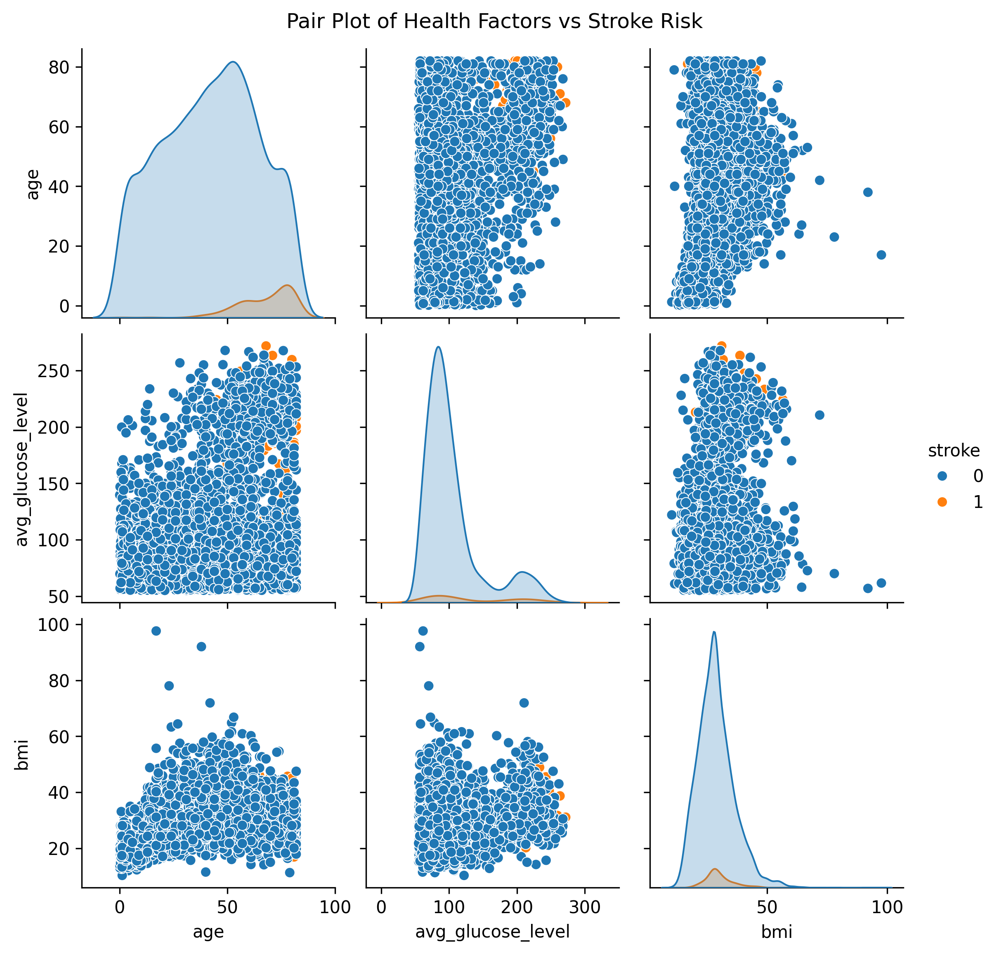
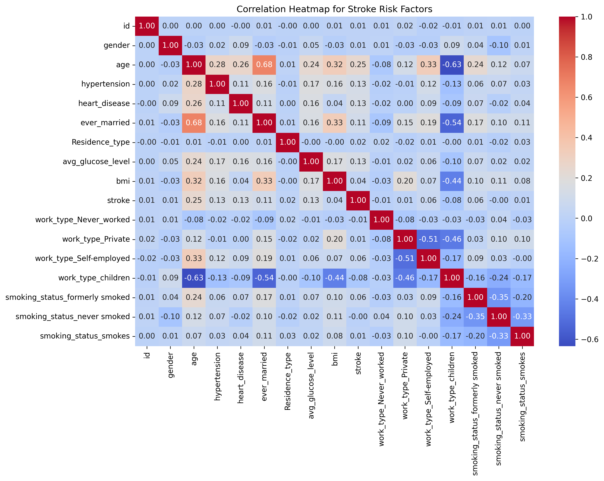

# **Stroke Risk Prediction Web App**
🚀 **Machine Learning | Tableau | Flask API | Frontend Optimization**

## **🔍 Overview**
This project focuses on developing a **stroke risk prediction web application** utilizing **machine learning and Flask API**. The web interface is built with **Bootstrap and custom CSS**, ensuring a responsive and accessible user experience. The backend is powered by XGBoost and is deployed on Render.

## Project Structure

Project4_MachineLearning/

└── healthcare-dataset-stroke-data  # Your dataset   

└── Stroke_Risk_Prediction.ipynb  # Jupyter notebook for exploring the model              

└── model/                  

      └── model_rf_new.pkl                          # Saved Random Forest model

      └── model_SVM.pkl                             # Saved SVM model

      └── stroke_logistic_reg_model.pkl             # Saved Logistic Regression model

      └── VotingClassifier_LR_RF_SVM_model.pkl      # Saved Voting Classifier (Logistic Regression + Random Forest + SVM)

      └── xgboost_model.pkl                          # Saved XGBoost model

└── static/    

       └── style.css           # CSS file for styling your web app


└── templates/      

        └── index.html          # HTML template for your web app's homepage          


└── app.py                  # Main file to run your Flask web app

└── Procfile                # For deployment (e.g., on Render)

└── requirements.txt        # Python dependencies

└── df_cleaned_export       # Input to app.py   

└── README.md               # Project documentation  


### **🔑 Key Features**
- ✅ **XGBoost model** achieving **high accuracy** for stroke prediction.
- ✅ **Flask API** for processing user input and returning risk assessments.
- ✅ **Bootstrap & CSS refinements** for a **seamless UI experience**.
- ✅ **Dark mode support** for enhanced accessibility and user comfort.

---

## **🛠️ How to Use**

**See required installs [here](requirements.txt)**
### **1️⃣ Running the Application**
Start the Flask server locally:
```bash
python app.py
```
The app will be available at **http://127.0.0.1:5000/**.

### **2️⃣ Using the Web Interface**
1. Open your browser and go to **http://127.0.0.1:5000/**.
2. Fill out the health information form (age, BMI, glucose levels, etc.).
3. Click **Predict** to receive a stroke risk assessment.
4. Review the results and follow the recommended lifestyle adjustments.

### **3️⃣ Deployment**
- Host for free on a number of cloud hosting sites: **Render, Heroku**, etc.
  

---
### Deploying to Render

1. Push the Code to GitHub

    git add .

    git commit -m "Initial commit"

    git push origin main

2. Deploy on Render

    1.	Go to Render.

    2.	Click New + → Web Service.

    3.	Connect your GitHub repository.

    4.	Set Build Command:

        pip install -r requirements.txt

    5.	Set Start Command:

        gunicorn app:app

    6.	Click "Deploy" and wait for deployment to complete.

## Troubleshooting

Getting a 404 Error?

•	Ensure index.html exists in the templates/ folder.

Model Not Found?

•	Make sure model_rf_new.pkl is inside the /model/ directory.

Deployment Failing on Render?

Try triggering a redeploy:

git commit --allow-empty -m "Trigger redeploy"

git push origin main

## **📊 Dataset Overview**
The dataset comprises **5,110 records** with **12 features**, covering **demographic, health, and lifestyle factors** influencing stroke risk. Key features include **age, hypertension, heart disease, smoking status, and body mass index (BMI)**, offering a comprehensive insight into stroke risk determinants.

### **🚩Challenges & Data Preprocessing Steps**
- **Handling Missing Data:** Rows with missing BMI and smoking status values were **dropped** to maintain data integrity.
- **Encoding Categorical Data:** Applied **one-hot encoding** for categorical variables such as **work type** and **smoking status**.
- **Addressing Class Imbalance:** No explicit balancing technique (such as SMOTE) was applied.
- **Feature Standardization:** Continuous variables like **age, BMI, and glucose levels** were **standardized** to ensure uniform scaling across the model.

### **🫀 Key Risk Factors**
- **Age (0.25 Correlation):** Stroke risk increases with age.
- **Average Glucose Level (0.13 Correlation):** High glucose levels correlate with an increased risk of stroke.
- **Heart Disease (0.13 Correlation):** Pre-existing heart conditions significantly raise stroke susceptibility.
- **Hypertension (0.13 Correlation):** High blood pressure is a major contributing factor.
- **Body Mass Index (BMI) (0.04 Correlation):** A weaker but present link to stroke risk.
- **Smoking Status (Former Smokers: 0.06 Correlation):** Former smokers exhibit slightly higher stroke risk compared to non-smokers and current smokers.



### **🫀 Takeaway:**
The most significant stroke risk factors are **older age, high blood sugar, heart disease, and hypertension**. Proactive management of these factors can notably reduce stroke risk.



---

## **📌 Summary of Findings & Real-World Impact**
Stroke is a leading global health concern, and early detection is critical for prevention. This project utilizes **XGBoost model** to develop a highly accurate stroke risk prediction model. The interactive web app enables users to assess their risk and receive **personalized health recommendations**.

### **🔑 Key Insights:**
- **Primary Risk Factors:** Age, glucose levels, hypertension, and heart disease are the most influential predictors.
- **Lifestyle Contributions:** Smoking status and work type also play notable roles.
- **Model Performance:** XGBoost was chosen for its high accuracy and performance in stroke risk prediction.
- **Practical Use Case:** Users can enter their health data to receive actionable insights for reducing their stroke risk.

Leveraging **machine learning**, this project provides a valuable tool for **early stroke detection**, empowering individuals to take **preventative action** before serious health issues arise.

---

## **🔄 Future Applications**
This model has promising applications across various sectors to enhance stroke prevention and intervention efforts:

- **Healthcare Institutions:** Integration with **electronic health records (EHR)** to identify high-risk patients and enable preventive care.
- **Public Health Initiatives:** Aggregated risk data can help policymakers and healthcare providers **identify at-risk communities** and optimize resource allocation.
- **Mobile Health Apps:** Embedding the model into mobile applications can provide **real-time stroke risk assessments** and personalized lifestyle recommendations.

### **🫀 Impact:**
By identifying individuals at high risk early and offering **customized recommendations**, this model can play a pivotal role in **reducing stroke prevalence** and supporting **proactive healthcare strategies**.

---

## **📜 License**
This project is licensed under the **MIT License**, allowing for modifications and improvements by the community.

Collaborators: 
- @GayatriRajagopalan
- @janetrodtx
- @mctrashmoney
- @Isalklm
- @baron14-coder
